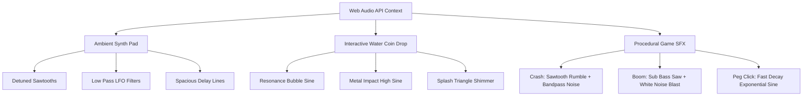

# 🌌 VoidBet | Premium Casino & Sportsbook SPA

[](https://developer.mozilla.org/en-US/docs/Web/JavaScript)
[](https://developer.mozilla.org/en-US/docs/Web/API/Web_Audio_API)
[](https://github.com/vikasbudiya/VoidBet)
[](https://en.wikipedia.org/wiki/SHA-2)

VoidBet is a state-of-the-art, high-fidelity, single-page application (SPA) Web Casino & Sportsbook. Built completely using **Vanilla HTML5, CSS3, and JavaScript (ES6+)**, it delivers a premium, hyper-immersive betting lobby packed with interactive physics-based games, real-time live odds simulators, custom procedural audio synthesizers, and an intelligent Disney-style companion mascot.

---

## 🧭 Table of Contents

1. [✨ Premium Features](#-premium-features)
   - [Original Games Suite](#1-playable-originals-suite-physics--math-engines)
   - [Live Sportsbook Catalogs](#2-live-sportsbook-catalogs--odds-simulators)
   - [Web Audio Sound System](#3-ambient-pads--procedural-audio-synthesizer)
   - [Disney-Style Mascot Companion](#4-disney-style-eyebrow-tracking-mascot-vibex)
   - [Crypto & Wallet State System](#5-reactive-crypto-multi-currency-wallet)
   - [Provably Fair Engine](#6-cryptographic-provably-fair-verifier)
2. [📁 Architecture & Directory Structure](#-architecture--directory-structure)
3. [⚙️ Installation & Getting Started](#%EF%B8%8F-installation--getting-started)
4. [🧠 Deep Engineering Insights](#-deep-engineering-insights)
   - [Mascot Cursor Tracking Algorithm](#mascot-pupil-eye-tracking-mechanics)
   - [Web Audio Node Pipelines](#web-audio-procedural-synthesis)
   - [Provably Fair Cryptographic Flowchart](#provably-fair-verification-scheme)
5. [💎 Design Tokens & Aesthetics](#-design-tokens--aesthetics)
6. [📜 License](#-license)

---

## ✨ Premium Features

### 1. Playable Originals Suite (Physics & Math Engines)
VoidBet features six fully playable original game engines built completely inside canvas and grid nodes:
*   🚀 **Rocket Crash**: Features flying dynamics mapped on bezier velocity curves. Users wager and auto-cashout before the rocket explodes. Integrates canvas screen shake, combustion particle trails, and active virtual bot wagers.
*   🔵 **Gravity Plinko**: Real-world physics simulation featuring pegged collision detection, circular rebound vectors, gravity force acceleration, adjustable risk profiles (Low, Medium, High), and peg collision audio.
*   💎 **MineGrid**: Fully interactive matrix game. Set mine ratios, sweep tiles to increase win multipliers, and cash out before hitting a mine.
*   🎡 **SpinCore**: Smooth circular wheel roulette featuring deceleration physics, beautiful light sweeps, and sectors with varied risk payouts.
*   🪙 **BattleFlip PvP**: Fast-paced chibi coinflip duel against real-time matching rival bots with double-or-nothing mechanics.
*   🎁 **LootRush**: Interactive holographic lootbox that utilizes CSS glitch-shake sequences and reveals custom multi-currency rewards.

### 2. Live Sportsbook Catalogs & Odds Simulators
An active live sports dashboard that updates wagers, match clocks, scores, and coefficients in real-time.
*   **Active Markets**: Esports (Valorant VCT Champions, CS2 PGL Major, BGMI Grind Season 5), Soccer (UEFA Champions League), MMA (UFC Main Card), NBA Basketball, and IPL Cricket.
*   **Dynamic Engine**: Automatically updates rounds, elapsed minutes, zones, match strikes, and adjusts odds ratios smoothly on the fly.

### 3. Ambient Pads & Procedural Audio Synthesizer
Rather than loading heavy audio assets, VoidBet generates **99% of its soundscapes procedurally in the browser** using the Web Audio API:
*   🎵 **Atmospheric Ambient Synth**: Generates spacious, slow-evolving synth pad loops (chords: `Cmin` → `Abmaj` → `Bbmaj` → `Gmin`) with low-pass filters sweeps and delay feedback pipelines.
*   🫧 **Water-Coin Drop**: A satisfying physical drop chime synthesized using three detuned oscillators that plays globally on control and button interactions.
*   💥 **Dynamic Game Effects**: High-precision synthesizers generating engine ignitions, tension pitch climbs, explosion booms, chiptune win arpeggios, and glitchy defeat sweeps.



### 4. Disney-Style Eyebrow-Tracking Mascot (Vibex)
A custom-built vector SVG companion mascot that brings the lobby to life:
*   👁️ **Pupil Tracking**: Monitors the user's cursor across the screen, calculating angles and limiting travel parameters to simulate premium, lifelike eye movements.
*   💬 **Context-Aware Tips**: Dynamically reacts to router views, warning users about parlay values, Plinko multipliers, or MineGrid risks.
*   🌟 **Emotional Reactions**: Transitions through animated blink cycles and emotional states (happy, sad, regular).

### 5. Reactive Crypto Multi-Currency Wallet
*   **Integrated Coins**: Multi-wallet state trackers for `ETH`, `SOL`, `BTC`, `USDT`, `BNB`, `DOGE`, and `XRP`.
*   **Dropdown Selector**: Seamless, Metamask-styled UI element that shifts current transaction units, updating balances globally.
*   **Interactive Panel**: Full deposit and withdrawal logs, processing network fee and gas estimates, and copying inbound addresses.

### 6. Cryptographic Provably Fair Verifier
A mathematical outcomes verification panel asserting client-side fairness:
*   Utilizes a standard **SHA-256 Combinatorial Scheme**: `Server_Seed:Client_Seed:Nonce`.
*   Provides adjustable client seed inputs, nonce indexing increments, and rotational server-seed generation.

---

## 📁 Architecture & Directory Structure

VoidBet is designed under a modular Single-Page Application (SPA) architecture, segregating layout structure, reactive storage, interactive renderers, and main coordinate binders:

```
VoidBet/
├── index.html          # Global SPA layout structure (Header, Sidebars, Modals & Canvas layers)
├── test_crash.html     # Dedicated standalone test workspace for physics tuning & collision checks
├── css/
│   └── styles.css      # Core premium design system, variables, glassmorphism panel styling
└── js/
    ├── data.js         # Reactive state manager, simulated DB, events emitter, and BOT logs
    ├── components.js   # Single-page router views renderers & client-side playable game engines
    └── app.js          # SPA Router dispatcher, eye-tracking coordination, & sound synthesizer
```

---

## ⚙️ Installation & Getting Started

Because VoidBet is fully contained within native client scripts, setting up a local lobby is simple and requires zero compilation or complex dependencies:

### 1. Clone the Repository
```bash
git clone https://github.com/vikasbudiya/VoidBet.git
cd VoidBet
```

### 2. Run a Local Development Server
To bypass browser CORS policies for modular local file access (such as reading custom resources or running AudioContext contexts reliably), run a lightweight web server:

**Using Node.js (`http-server`):**
```bash
npx http-server -p 8080
```

**Using Python:**
```bash
python -m http.server 8080
```

### 3. Open in Browser
Point your web browser to:
`http://localhost:8080`

---

## 🧠 Deep Engineering Insights

### Mascot Pupil Eye-Tracking Mechanics
The pupil tracking coordinates loop runs inside a global mouse event listener, calculating exact relative angles between the user's pointer and the geometric center of each iris SVG path:

```javascript
// Relative pupil coordinates translation
const lx = leftPupil.getBoundingClientRect().left + 8;
const ly = leftPupil.getBoundingClientRect().top + 10;

const maxOffset = 6.0; // Pupil movement threshold
const dx = e.clientX - lx;
const dy = e.clientY - ly;
const dist = Math.sqrt(dx*dx + dy*dy);
const angle = Math.atan2(dy, dx);
const travel = Math.min(dist * 0.05, maxOffset);

leftPupil.style.setProperty("--left-eye-x", (Math.cos(angle) * travel) + "px");
leftPupil.style.setProperty("--left-eye-y", (Math.sin(angle) * travel) + "px");
```

### Web Audio Procedural Synthesis
VoidBet leverages low-latency, modular node routing graphs to achieve synthesis. For example, the **Water-Coin Drop** is synthesized by patching three distinct oscillators to their respective gain envelopes and routing them to the master destination node:

```javascript
const ctx = getClickCtx();

// 1. Resonance Bubble
const osc1 = ctx.createOscillator();
const gain1 = ctx.createGain();
osc1.type = "sine";
osc1.frequency.setValueAtTime(580, ctx.currentTime);
osc1.frequency.exponentialRampToValueAtTime(1100, ctx.currentTime + 0.05);
osc1.frequency.exponentialRampToValueAtTime(320, ctx.currentTime + 0.2);
gain1.gain.setValueAtTime(0.001, ctx.currentTime);
gain1.gain.linearRampToValueAtTime(0.15, ctx.currentTime + 0.02);
gain1.gain.exponentialRampToValueAtTime(0.001, ctx.currentTime + 0.22);
osc1.connect(gain1);
gain1.connect(ctx.destination);

// 2. High Metallic Impact
const osc2 = ctx.createOscillator();
const gain2 = ctx.createGain();
osc2.type = "sine";
osc2.frequency.setValueAtTime(2600, ctx.currentTime);
osc2.frequency.exponentialRampToValueAtTime(750, ctx.currentTime + 0.08);
gain2.gain.setValueAtTime(0.001, ctx.currentTime);
gain2.gain.linearRampToValueAtTime(0.08, ctx.currentTime + 0.015);
gain2.gain.exponentialRampToValueAtTime(0.001, ctx.currentTime + 0.12);
osc2.connect(gain2);
gain2.connect(ctx.destination);

// 3. Splash Shimmer
const osc3 = ctx.createOscillator();
const gain3 = ctx.createGain();
osc3.type = "triangle";
osc3.frequency.setValueAtTime(4200, ctx.currentTime);
osc3.frequency.exponentialRampToValueAtTime(1800, ctx.currentTime + 0.1);
gain3.gain.setValueAtTime(0.001, ctx.currentTime);
gain3.gain.linearRampToValueAtTime(0.03, ctx.currentTime + 0.01);
gain3.gain.exponentialRampToValueAtTime(0.001, ctx.currentTime + 0.1);
osc3.connect(gain3);
gain3.connect(ctx.destination);

osc1.start(); osc2.start(); osc3.start();
```

### Provably Fair Verification Scheme
The verifier maps a standard cryptographic chain that verifies game results:

```
[ Revealed Server Seed ] ──┐
                           ├─► [ SHA-256 Hashing Process ] ─► [ Outcome Hex Decryption ] ─► [ Assert Match ]
[ Client Seed (Adjust) ] ──┤
                           │
[ Nonce Index (Bets) ] ────┘
```

---

## 💎 Design Tokens & Aesthetics

VoidBet's premium design is built upon carefully calibrated custom CSS properties, ensuring vibrant accents and visual glassmorphism across both Light and Dark themes:

| Variable | Cyber-Dark Value | Matte-Light Value | Role |
| :--- | :--- | :--- | :--- |
| `--cyber-cyan` | `#00f3ff` | `#009bb3` | High-frequency neon highlights |
| `--neon-purple` | `#bf55ec` | `#912fbe` | Crown highlights & secondary buttons |
| `--brand-gold` | `#c99a4e` | `#a37a34` | Hex logos, VIP states & luxury borders |
| `--panel-bg` | `rgba(18, 19, 26, 0.65)` | `rgba(255, 255, 255, 0.7)` | Glassmorphism card backdrops |
| `--glass-blur` | `blur(16px)` | `blur(12px)` | Ambient blurring depth |

---

## 📜 License

Distributed under the No License yet. See `LICENSE` for more information.

---

<p align="center">
  Developed by <a href="https://github.com/vikasbudiya">Vikas Budiya</a> • Designed with 🌌 my self
</p>
